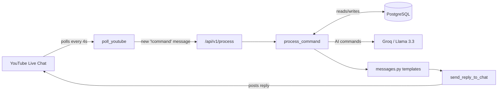

<div align="center">

# AuriBot

### A YouTube Live Chat companion for study‑with‑me streams

AuriBot sits in your live chat and turns `!commands` into real functionality — tracking focus
sessions, handing out XP and levels, running a leaderboard, answering study questions with AI,
and giving mods and the owner tools to keep the stream running smoothly.


</div>

---

## 📖 Table of Contents

- [What it does](#-what-it-does)
- [How it works](#-how-it-works)
- [Database schema](#-database-schema)
- [The XP & leveling system](#-the-xp--leveling-system)
- [Commands](#-commands)
- [Getting started](#-getting-started)
  - [1. Prerequisites](#1-prerequisites)
  - [2. Clone & install](#2-clone--install)
  - [3. Set up a database](#3-set-up-a-database)
  - [4. Get your YouTube API keys](#4-get-your-youtube-api-keys)
  - [5. Set your channel (auto-detects your live chat)](#5-set-your-channel-auto-detects-your-live-chat--recommended)
  - [6. Get OAuth credentials (so the bot can reply)](#6-get-oauth-credentials-so-the-bot-can-reply)
  - [7. Get a Groq API key](#7-get-a-groq-api-key)
  - [8. Configure `.env`](#8-configure-env)
  - [9. Run it](#9-run-it)
- [Background jobs](#-background-jobs)
- [Environment variables reference](#-environment-variables-reference)
- [Customizing what the bot says](#-customizing-what-the-bot-says)
- [Project structure](#-project-structure)
- [Troubleshooting](#-troubleshooting)
- [Known limitations](#-known-limitations)
- [License](#-license)

---

## ✨ What it does

| | |
|---|---|
| 🎯 **Focus sessions** | `!start` / `!stop` track how long each viewer studies and convert it into XP |
| 🏆 **Leveling & leaderboards** | Total/daily/monthly XP, levels, streaks, and ranked leaderboards |
| 🤖 **AI-powered commands** | `!ask`, `!plan`, `!quiz` — powered by Meta's Llama 3.3 (70B) via Groq |
| 🔗 **Auto-expiring answer pages** | Long AI answers become a styled, temporary web page instead of a wall of chat text |
| 🛡️ **Moderation tools** | `!ban`, `!timeout`, `!slowmode` for mods; `!announce`, `!event`, `!givexp` for the owner |
| 🔑 **Multi-key quota rotation** | Automatically rotates across several YouTube API keys, and backs off gracefully if all are exhausted |
| ⏱️ **Stream-end safety net** | If the stream ends while someone forgot to `!stop`, their session is closed automatically (at a reduced XP rate) instead of being lost |
| 💬 **Every reply is editable** | All chat text lives in one file — [`messages.py`](./messages.py) — no code editing needed to change wording |

---

## 🧠 How it works



1. **`poll_youtube`** checks the live chat every ~4 seconds for new messages starting with `!`, using
   YouTube's `liveChat/messages` endpoint with `pageToken`-based pagination so nothing is double-processed.
2. Each command is POSTed internally to **`/api/v1/process`**, which hands it to **`process_command`** — the
   function that reads/updates the database and decides what should happen.
3. The actual *wording* of every reply comes from **`messages.py`**; `process_command` builds data, never
   sentences.
4. **`send_reply_to_chat`** posts the reply back to the stream using the bot's own OAuth-authenticated
   YouTube account, automatically shortening anything over YouTube's 200-character limit on a clean word
   break (never mid-word or mid-emoji).

If the YouTube API reports the live chat has ended or its ID has expired, the bot automatically closes out
any sessions viewers forgot to `!stop`, awarding them a reduced amount of XP (see
[`PENALTY_MULTIPLIER`](#-environment-variables-reference)) rather than losing their progress entirely.

---

## 🗄️ Database schema

AuriBot creates these tables automatically on first run — no manual migrations needed.

| Table | Purpose |
|---|---|
| **`users`** | One row per viewer: their YouTube channel ID and display name. |
| **`viewer_profiles`** | One row per user: total/daily/weekly/monthly XP, level, streaks, study minutes, and free-form preferences (like their current `!goal`). |
| **`study_sessions`** | Every `!start` → `!stop` session, with start/end time and duration. Rows with `end_time = NULL` are sessions still in progress. |
| **`xp_logs`** | An audit trail of every XP award — amount, source (`study`, `auto_stop`, `givexp`, …), and timestamp. |
| **`moderation_actions`** | Every `!ban` / `!timeout`, who issued it, the reason, and when it expires. |
| **`system_settings`** | A generic key/value store used for slowmode duration, the current announcement, event details, and Discord/schedule/social links set via chat commands. |

---

## 📈 The XP & leveling system

- **Studying**: `1 XP per minute studied`, **+5 bonus XP** if the session was 30 minutes or longer.
- **Level**: `level = floor(sqrt(total_xp / 50)) + 1` — leveling gets progressively slower as you go up.
- **Streaks**: studying on consecutive calendar days (UTC) increases your streak; missing a day resets it
  to 1. Your best-ever streak is tracked separately from your current one.
- **Forgot to `!stop`?** If the stream ends before you do, your session is closed automatically and you
  still get XP — just at `PENALTY_MULTIPLIER` (80% by default) instead of the full amount.

---

## 🗨️ Commands

### Everyone

| Command | What it does |
|---|---|
| `!start [goal]` | Begin a study session (optionally attach a goal to it) |
| `!stop` | End your session and bank the XP |
| `!goal [text]` | View your current goal, or set a new one |
| `!xp` | Quick check of today's + lifetime XP |
| `!time` | How long you've studied today, and whether a session is active |
| `!hours` | Lifetime study hours |
| `!streak` | Current and best-ever study streak |
| `!profile` | Full stat card: level, XP, streak, hours |
| `!rank [daily\|monthly\|all_time]` | Your leaderboard position for that period |
| `!level` | Your level and the XP total needed for the next one |
| `!ask <question>` | Ask the AI anything study-related |
| `!plan <topic>` | Get a 2-week study plan |
| `!quiz <subject>` | Get a 5-question multiple-choice quiz |
| `!motivate` / `!quote` | A random motivational or famous quote |
| `!coffee` / `!hug [@user]` | Just for fun |
| `!discord` / `!schedule` / `!social` | Community links, configured by the owner |
| `!help` | The full command list, as a web link |

### Moderators

| Command | What it does |
|---|---|
| `!ban @user [reason]` | Bans a viewer from using the bot (1 year, effectively permanent) |
| `!timeout @user <minutes> [reason]` | Temporarily blocks a viewer from using the bot |
| `!slowmode [seconds]` | Limits how often *any* viewer can trigger a command (default 10s if no number given) |

### Owner only

| Command | What it does |
|---|---|
| `!announce <message>` | Stores an announcement (shown back to whoever asks) |
| `!event <details>` | Sets the next community event, shown via `!schedule` |
| `!givexp @user <amount>` | Manually awards XP to a viewer |

> Moderator/owner status is checked against `OWNER_YOUTUBE_ID` and `MOD_YOUTUBE_IDS` in your `.env` —
> viewers who aren't listed there simply can't trigger those commands, no matter what they type.

---

## 🚀 Getting started

### 1. Prerequisites

- Python 3.11+
- A PostgreSQL database (e.g. [Neon](https://neon.tech), [Supabase](https://supabase.com), [Railway](https://railway.app), or your own server)
- A Google Cloud project with the **YouTube Data API v3** enabled
- A [Groq](https://console.groq.com) account (free tier is enough)

### 2. Clone & install

```bash
git clone https://github.com/aurips/YouTube-Study-with-Me-Chatbot.git
cd auribot
python -m venv venv

# Windows
.\venv\Scripts\activate.bat
# macOS / Linux
source venv/bin/activate

pip install -r requirements.txt
```

### 3. Set up a database

Create a Postgres database anywhere you like and grab its connection string — you'll need it for
`DATABASE_URL` in step 8. You don't need to create any tables yourself; the bot does that automatically
the first time it starts.

### 4. Get your YouTube API keys

1. Go to the [Google Cloud Console](https://console.cloud.google.com/) → create or select a project.
2. **APIs & Services → Library** → search for **YouTube Data API v3** → click **Enable**.
3. **APIs & Services → Credentials → Create Credentials → API key**.
4. You can create more than one key (e.g. across a couple of Cloud projects) and list them all,
   comma-separated, in `YOUTUBE_API_KEYS` — the bot automatically rotates to the next key if one runs out
   of daily quota, and backs off for 5 minutes if all of them are exhausted.

### 5. Set your channel (auto-detects your live chat — recommended)

By default, the bot figures out your live chat ID by itself: set `YOUTUBE_CHANNEL_ID` to your channel ID
(the same one you'd use for `OWNER_YOUTUBE_ID` — if you leave `YOUTUBE_CHANNEL_ID` blank, it just reuses
`OWNER_YOUTUBE_ID`) and the bot will look up whatever's currently live on that channel every time it starts,
and again automatically whenever a stream ends. No copying IDs between streams.

If you'd rather pin it manually (e.g. for testing against a specific broadcast), you can still set
`YOUTUBE_BROADCAST_ID` directly to a **live chat ID** (not the video URL or video ID) — this takes priority
over auto-detection whenever it's set. To find one by hand:

```
GET https://www.googleapis.com/youtube/v3/videos
    ?part=liveStreamingDetails
    &id=<your video ID>
    &key=<one of your API keys>
```

The response's `items[0].liveStreamingDetails.activeLiveChatId` is what you'd paste into
`YOUTUBE_BROADCAST_ID`. Note that a manually-set ID still self-heals through auto-detection once it expires,
as long as `YOUTUBE_CHANNEL_ID` is also set — which it is by default, via `OWNER_YOUTUBE_ID`.

### 6. Get OAuth credentials (so the bot can reply)

A plain API key can only **read** the chat — posting replies requires OAuth credentials tied to the
YouTube account you want the bot to talk as (this can be your own channel or a dedicated bot account).

1. In the same Cloud project: **APIs & Services → Credentials → Create Credentials → OAuth client ID**
   (choose "Desktop app").
2. Use the [OAuth 2.0 Playground](https://developers.google.com/oauthplayground/) (or a short local script)
   to authorize with scope `https://www.googleapis.com/auth/youtube.force-ssl`, sign in as the account you
   want the bot to post as, and exchange the authorization code for a **refresh token**.
3. Put the client ID, client secret, and refresh token into `GOOGLE_CLIENT_ID`, `GOOGLE_CLIENT_SECRET`, and
   `GOOGLE_REFRESH_TOKEN`. The bot uses the refresh token to mint new access tokens on its own — you only
   need to do this once (unless you revoke access).

### 7. Get a Groq API key

Sign up at [console.groq.com](https://console.groq.com), create an API key, and put it in `GROQ_API_KEY`.

### 8. Configure `.env`

Copy `.env.example` to `.env` and fill in everything from the steps above, plus:

- `OWNER_YOUTUBE_ID` — your own channel ID, so owner commands work for you (and so auto-detection knows
  which channel to watch, unless you set `YOUTUBE_CHANNEL_ID` separately).
- `MOD_YOUTUBE_IDS` — leave blank until you're ready to add moderators; add their channel IDs,
  comma-separated, whenever you like.
- `PUBLIC_URL` — the URL your bot is reachable at (used to build the links `!ask`/`!plan`/`!quiz`/`!help`
  send back). For local testing this can be `http://localhost:8000`, but AI-answer and help links won't be
  clickable by viewers unless the bot is actually deployed somewhere public.

### 9. Run it

```bash
python main.py
```

On first run you'll see the bot create its tables, then start polling. Try `!help` in your live chat once
it's running to confirm everything's connected.

---

## ⏰ Background jobs

These run automatically once the bot is up — nothing to configure:

| Job | Frequency | What it does |
|---|---|---|
| **Chat polling** | Every ~4 seconds | Checks for new `!commands` in the live chat |
| **Live broadcast auto-detect** | On startup, and whenever a stream ends | Looks up whatever's currently live on `YOUTUBE_CHANNEL_ID` and connects to its chat automatically |
| **Daily reset** | Once a day at 00:00 UTC | Resets everyone's `daily_xp` to 0; resets streaks for anyone who didn't study yesterday; deletes session/XP-log records older than 30 days |
| **Weekly reset** | Every Monday at 00:00 UTC | Resets everyone's `weekly_xp` to 0 |
| **Monthly reset** | 1st of the month, 00:00 UTC | Resets everyone's `monthly_xp` to 0 |
| **Paste cleanup** | Every 60 seconds | Deletes AI-answer/help web pages older than 10 minutes |
| **Stream-end auto-stop** | Whenever the API reports the chat has ended | Closes any sessions still open, applying `PENALTY_MULTIPLIER` |

---

## ⚙️ Environment variables reference

| Variable | Required | Description |
|---|:---:|---|
| `DATABASE_URL` | ✅ | PostgreSQL connection string. `postgres://` / `postgresql://` URLs are auto-converted to the async driver. |
| `GROQ_API_KEY` | ✅ | Powers `!ask`, `!plan`, `!quiz`. |
| `YOUTUBE_API_KEYS` | ✅ | One or more comma-separated YouTube Data API keys, rotated automatically on quota errors. |
| `YOUTUBE_CHANNEL_ID` | recommended | Channel to auto-detect the current live broadcast on. Defaults to `OWNER_YOUTUBE_ID` if left blank. |
| `YOUTUBE_BROADCAST_ID` | optional | Manually pins a specific **live chat ID** instead of auto-detecting (see [step 5](#5-set-your-channel-auto-detects-your-live-chat--recommended)). Leave blank to just use auto-detection. |
| `GOOGLE_CLIENT_ID` / `GOOGLE_CLIENT_SECRET` / `GOOGLE_REFRESH_TOKEN` | ✅ | OAuth credentials so the bot can **post** replies (see [step 6](#6-get-oauth-credentials-so-the-bot-can-reply)). |
| `OWNER_YOUTUBE_ID` | ✅ | Your channel ID — unlocks owner-only commands, and doubles as the default for `YOUTUBE_CHANNEL_ID`. |
| `MOD_YOUTUBE_IDS` | optional | Comma-separated channel IDs of moderators. Safe to leave blank. |
| `PUBLIC_URL` | ✅ | The public URL your bot is hosted at, used to build shareable links. |
| `BOT_NAME` | optional | Defaults to `AuriBot`. |
| `PORT` | optional | Defaults to `8000`. |
| `PENALTY_MULTIPLIER` | optional | Defaults to `0.8`. Fraction of XP kept if a viewer forgets `!stop` before the stream ends. |

---

## 🎨 Customizing what the bot says

Every message the bot can send lives in **[`messages.py`](./messages.py)** — nothing about wording is
buried inside the bot's logic.

```python
# messages.py
STOP_SUCCESS = "✅ Great work, {display_name}! You studied {minutes} min and earned +{xp} XP. Your total is now {total_xp} XP!"
```

To change how the bot talks:

1. Open `messages.py`.
2. Find the line for the command you want to change.
3. Edit the text — keep every `{placeholder}` exactly as-is (that's what `main.py` fills in automatically).
4. Save and restart the bot. No changes to `main.py` needed.

Long viewer names and long generated replies are handled for you automatically: `main.py` shortens overly
long display names and trims any reply over YouTube's 200-character limit on a clean word break, so you
don't need to count characters when editing `messages.py`.

---

## 🧩 Project structure

```
.
├── main.py           # Bot logic: polling, DB models, command routing, API server
├── messages.py       # Every chat reply, in plain editable text
├── requirements.txt  # Python dependencies
├── .env.example      # Template for your own .env
└── .env              # Your configuration (create this yourself, never commit it)
```

---

## 🛠️ Troubleshooting

**`asyncpg.exceptions.UndefinedTableError: relation "study_sessions" does not exist` on first run**
This was a startup-ordering bug where the database session that loads active sessions ran before the
table-creation transaction had committed. It's fixed in the current version — make sure you're running the
latest `main.py`. If you still see it, double check you don't have an older cached copy of the file.

**Bot connects but never replies in chat**
Usually means the OAuth credentials are missing or wrong — a plain API key can read chat but can't post to
it. Double-check `GOOGLE_CLIENT_ID` / `GOOGLE_CLIENT_SECRET` / `GOOGLE_REFRESH_TOKEN` were generated with the
`youtube.force-ssl` scope, authorized as the account you want posting.

**`No live chat ID available` in the logs**
Neither `YOUTUBE_CHANNEL_ID` nor `YOUTUBE_BROADCAST_ID` is set, or nothing's currently live on
`YOUTUBE_CHANNEL_ID`. If you're relying on auto-detection, this is expected whenever the channel isn't
streaming — it'll pick the broadcast up automatically once one starts (see
[step 5](#5-set-your-channel-auto-detects-your-live-chat--recommended)).

**Quota errors / bot goes quiet for a few minutes**
Expected behavior once *all* configured keys hit their daily YouTube API quota — the bot backs off for 5
minutes at a time rather than spamming failed requests. Add more keys to `YOUTUBE_API_KEYS` if this happens
often.

---

## 📌 Known limitations

- `!ban` / `!timeout` / `!givexp` first try an exact (case-insensitive) name match; if that fails they fall
  back to a partial search. If more than one viewer matches, the bot tells you the candidate names instead
  of guessing — just re-run the command with a more specific/exact name.
- Auto-detecting the live broadcast relies on `search().list(eventType="live")`, which can take a little
  time to reflect a stream that only just went live — if the bot doesn't pick it up immediately, it'll catch
  it on the next 30-second retry.

---

## 📄 License

This project is licensed under the **Auritra Non-Commercial License (ANCL) v1.0**.

### ✅ You may

* Use this project for personal, educational, and research purposes.
* Study, stream, or share this project for others to use.
* Modify the source code.
* Create your own projects based on this code.
* Share and distribute your modified versions.

### ❗ Conditions

* You **must** include this license in any copies or derivative works.
* You **may not** use this project or its derivatives for commercial purposes or sell them without written permission.

If you'd like to use this project commercially, please contact **Auritra** for permission.


---
<p align="center">
  Crafted with ☕, code, and ❤️ by <strong>Auritra</strong>
</p>
